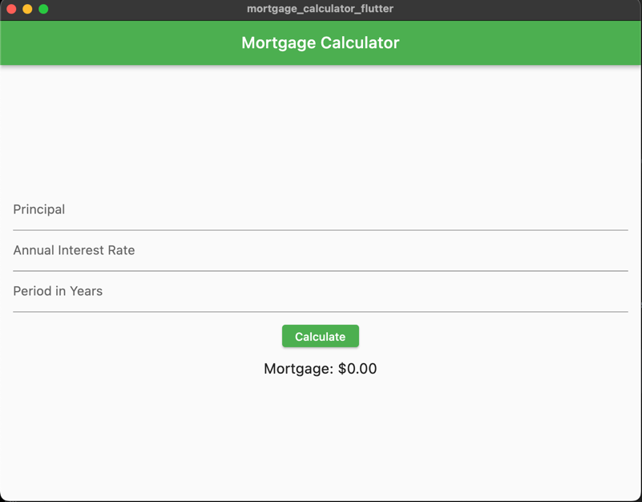

# Mortgage Calculator

This is a simple mortgage calculator app built with Flutter. It allows users to calculate their monthly mortgage payments based on the principal amount, annual interest rate, and the period in years.

## Features

- Enter the principal amount, annual interest rate, and period in years.
- Calculates the monthly mortgage payment.
- Displays the mortgage amount in a formatted currency.

## Screenshots

Include screenshots or gifs of your app here to give users a visual preview.


## Getting Started

To get started with this project, follow the instructions below:

### Prerequisites

- Flutter SDK: [Installation Guide](https://flutter.dev/docs/get-started/install)

### Installation

1. Clone the repository:

```bash
git clone https://github.com/your-username/mortgage_calculator.git
```

2. Navigate to the project directory:

```bash
cd mortgage_calculator
```

3. Fetch dependencies:

```bash
flutter pub get
```

4. Fetch dependencies:

```bash
flutter run
```
### Usage
Launch the app on your device or emulator.
Enter the principal amount, annual interest rate, and period in years.
Tap on the "Calculate" button.
The calculated mortgage amount will be displayed.
Contributing
Contributions are welcome! If you find any issues or have suggestions for improvements, feel free to submit a pull request or open an issue.

### License
This project is licensed under the MIT License.


Make sure to replace the placeholders and customize the content according to your project's details. Include relevant information such as installation instructions, usage guidelines, and contribution guidelines. Feel free to enhance the README with additional sections or details as needed.

